% title: Optimal Markov Models
% subtitle: Formulation & Pursuit
% author: Robert T. McGibbon
% author: September 29, 2014
% thankyou: More questions?
% thankyou_details:  Thanks everyone! Especially Vijay, Christian.
% contact: www <a href="http://rmcgibbo.appspot.com">website</a>
% contact: github <a href="http://github.com/rmcgibbo">rmcgibbo</a>
% favicon: http://www.stanford.edu/favicon.ico

---
title: Overview
build_lists: true

- Motivation
    * Quantitative analysis of molecular simulations
- The problem with current MSMs
    * What's the loss function?
- A variational formulation of MSMs
    * Generalized matrix Rayleigh quotient
- Pursuing the optimal model
    * Optimization of a noisy, stochastic, and expensive function
      over an awkward search space

---
title: Motivation
subtitle: Quantitative analysis of molecular simulations
class: segue dark nobackground

---
title: Experiments Can't Do It Alone

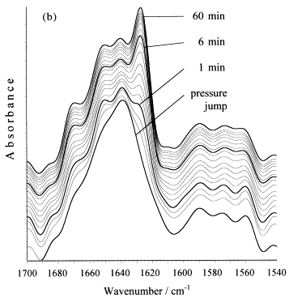

 

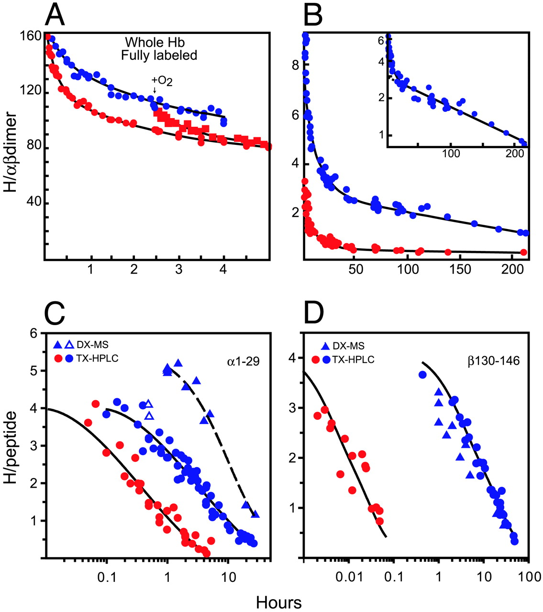

<footer class="source">

S. Westenhoff et al., <i>Nature Methods</i> 7, 775 (2010). &nbsp; | &nbsp;
G. Panick et al., <i> J. Mol. Biol. </i> 275 389 (1998)  &nbsp; | &nbsp;
Y Li et al., <i>J. Biol. Chem.</i> 277 33018 (2002)   
X. Zhuang; M. Rief, <i>Curr. Opin. Struct. Biol</i> 13 88 (2003) &nbsp; | &nbsp;
J. J. Englander et al., <i> Proc. Natl. Acad. Sci. U.S.A. </i> 100 7057 (2003)  
I J. Finkelstein et al., <i> Proc. Natl. Acad. Sci. U.S.A. </i> 104 2637 (2007)

</footer>

---
title: The relevant atomic physics is settled*

	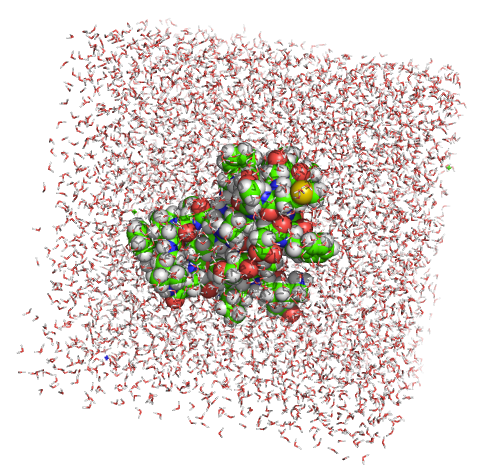
	 
	

	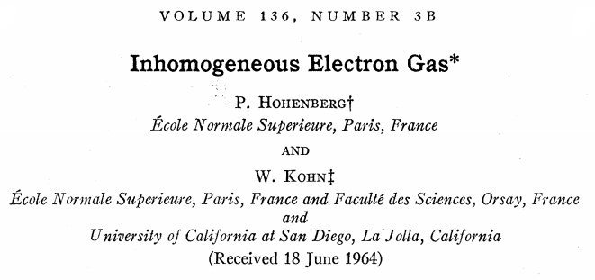
	 
	

	
	 
	

	
	

<footer class="source">
Hohenberg, Kohn <a href="http://doi.org/10.1103/PhysRev.136.B864">10.1103/PhysRev.136.B864</a>, &nbsp;
Jones <a href="http://doi.org/10.1098/rspa.1924.0082">10.1098/rspa.1924.0082</a>,  
Buckingham <a href="http://doi.org/10.1098/rspa.1938.0173">10.1098/rspa.1938.0173</a>, &nbsp;
Cornell et al. <a href="http://doi.org/10.1021/ja00124a002">10.1021/ja00124a002</a>
</footer>

---
title: Simulations are no longer rate limiting*

    

    

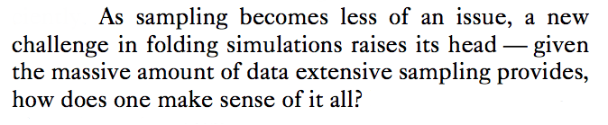

In 10 years, GPUs will likely be 100-1000x more powerful!

<footer class="source">
    Lane et al. <a href="http://doi.org/10.1016/j.sbi.2012.11.002">10.1016/j.sbi.2012.11.002</a>
</footer>

---
title: Why aren't we there yet with Markov modeling?
class: segue dark nobackground

---
title: MSMs lack systematic parameter selection
build_lists: true

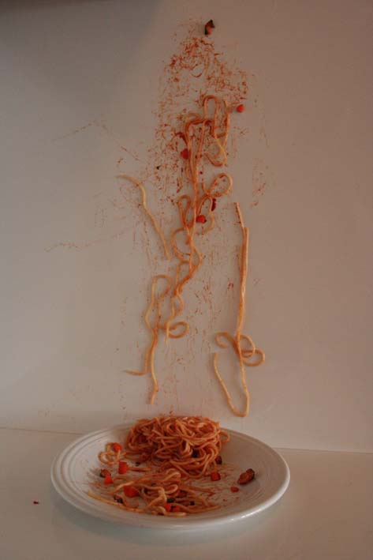

- What featurization?
    * Cartesian, dihedrals, contact distances?
- Dimensionality Reduction?
    * PCA, tICA?
- What clustering method?
    * k-centers, k-means, hierachical?
- How many states?

---
title: Lack of systematic parameter selection

 
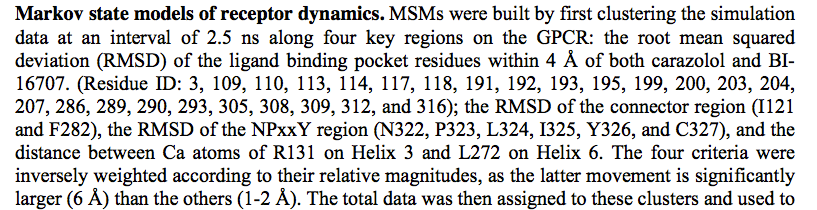

<footer class="source">
    Kohlhoff et al. <a href="http://doi.org/10.1038/nchem.1821">10.1038/nchem.1821</a>

---
title: Lack of systematic parameter selection

  

<footer class="source">
    Lane, Pande <a href="http://doi.org/10.1021/ja207470h">10.1021/ja207470h</a>

---
title: Lack of systematic parameter selection

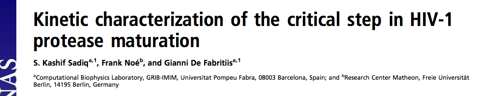
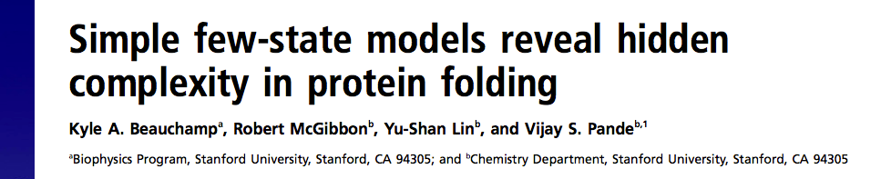

 

<footer class="source">
    Sadiq, Noé, De Fabritiis <a href="http://doi.org/10.1073/pnas.1210983109">10.1073/pnas.1210983109</a>  
    Beauchamp et al. <a href="http://doi.org/10.1073/pnas.1201810109">10.1073/pnas.1201810109</a>    

---
title: Optimal MSMs
subtitle: A variational formulation via a generalized matrix Rayleigh quotient
class: segue dark nobackground

---
title: The Propagator

$$
\begin{align}
p_{t+\tau}(\mathbf{y}) = \int_\Omega d\mathbf{x} \; p(\mathbf{x}, \mathbf{y};& \tau) \, p_t(\mathbf{x}) = \fcolorbox{black}{white}{$\mathcal{P}(\tau)$} \circ p_t(\mathbf{y}) \\\
\mathcal{P}(\tau) \circ \phi_i &= \lambda_i \phi_i \\\
p_{t+k\tau}(\mathbf{x}) &= \sum_{i=1}^\infty \lambda_i^k \langle p_t, \phi_i \rangle_{\mu^{-1}}\; \phi_i
\end{align}
$$

<footer class="source">
    Ode et al. <a href="http://doi.org/10.3389/fmicb.2012.00258">10.3389/fmicb.2012.00258</a>
</footer>

---
title: Low-rank approximations
subtitle: How do we compress the propagator?

$$
\left(
 \vphantom{\begin{array}{c}1\\1\\1\\1\\1\end{array}}
  \smash{\begin{array}{ccccc}
     \;\;\;\;\;\;&&&&\\
     &&&&\\
     &P&&&\\
     &&&&\\
     &&&&
\end{array}}\right)
\;\approx\;
\left( 
 \vphantom{\begin{array}{c}1\\1\\1\\1\\1\end{array}}
  \smash{\begin{array}{c}
         \\
         \\
         V\\
         \\
         \\
\end{array}}\right)
\times
\left( 
 \vphantom{\begin{array}{c}1\\1\end{array}}
  \smash{
  \begin{array}{ccccc}
         &&U^T&&\\
  \end{array}}
\right)
$$

---
title: Low-rank approximations
subtitle: How do we compress the propagator?

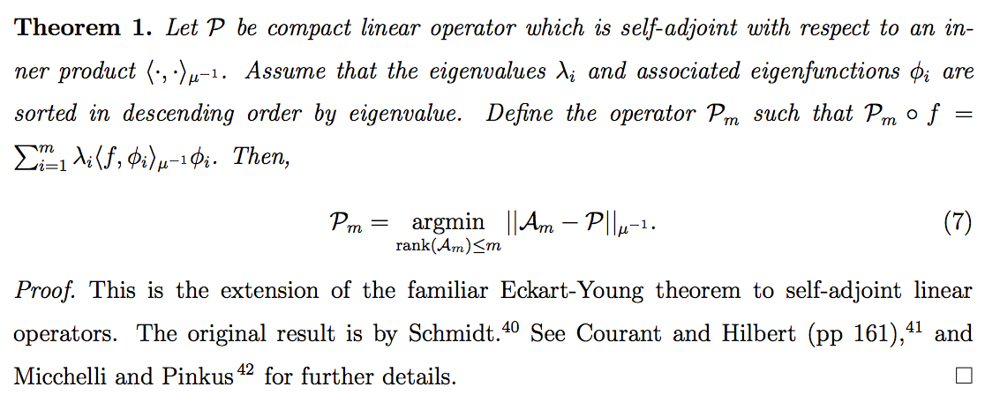

---
title: Low-rank approximations
subtitle: How do we compress the propagator?

In english please?

---
title: Low-rank approximations
subtitle: How do we compress the propagator?

- The first $m$ eigenfunctions, $\{\phi_1, \ldots, \phi_m\}$  would yield the **optimal**
  rank-$m$ approximation to the dynamics.
    - These are the slow degrees of freedom.
    - The long timescale dynamical processes.
    - The reaction coordinate(s).

That sounds promising. So how do we find them?

---
title: Problem statement
subtitle: Principled parameterization of low-rank models of dynamics

- Using some _ansatz_ eigenfunctions ${\color{unknown}f}=\{f_i(\cdot)\}_{i=1}^m$,
  and some $\color{data}\text{MD data}$,
- Develop an <it>optimization</it> problem (learning objective),
$$
{\color{learned}f^*}= \operatorname*{argmax}_{\color{unknown}f}\;
\underbrace{\operatorname{Score}}_\text{Find me!}[{\color{unknown}f}; {\color{data}\text{data}}]
$$
whose solution, ${\color{learned}f^*}$, given infinite $\color{data}\text{MD data}$,
would be the first $m$ eigenfunctions of $\fcolorbox{black}{white}{\(\mathcal{P}(\tau)\)}$.

 
   

---
title: Variational theorem for eigenspaces

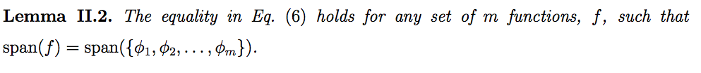

---
title: Linear variation with basis functions

    
Given basis functions, $\{\varphi_a\}$, let $f_i(x) = \sum_a {\color{unknown}A_{ia}}\, \mu(\mathbf{x}) \varphi_a(\mathbf{x})$.
 
$$
\begin{align}
{\color{data}C_{ab}} &= \langle \mu \varphi_a, \mathcal{P}(\tau) \circ \mu \varphi_b \rangle_{\mu^{-1}}
\approx \overbrace{\frac{1}{T} \sum_t^T \varphi_a(\mathbf{x}_t) \varphi_b(\mathbf{x}_{t+\tau})}^{\color{data}\text{from MD data}} \\
{\color{data}S_{ab}} &= \langle \mu \varphi_a, \mu \varphi_b \rangle_{\mu^{-1}} \approx \frac{1}{T} \sum_t^T \varphi_a(\mathbf{x}_t) \varphi_b(\mathbf{x}_t)
\end{align}
$$

$$
\begin{align}
\mathcal{R}_\mathcal{P}[f] &= \operatorname{Tr}\left[P(f)\,Q(f)^{-1}\right] \\
&= \operatorname{Tr}\left[({\color{unknown}A}^T{\color{data}C}{\color{unknown}A})
    ({\color{unknown}A}^T{\color{data}S}{\color{unknown}A})^{-1}\right]
\end{align}
$$

---
title: MSMs and tICA
subtitle: Different bases, <it>same objective</it>

Using basis functions, we now have a "standard" problem.
$$
{\color{learned}A^*} = \operatorname*{argmax}_{\color{unknown}A}\; \operatorname{Tr}\left[({\color{unknown}A}^T{\color{data}C}{\color{unknown}A})
    ({\color{unknown}A}^T{\color{data}S}{\color{unknown}A})^{-1}\right]
$$

- If $\varphi_m(\mathbf{x})$ are linearly independent geometrical features:
    -  This is tICA, and ${\color{learned}A^*}$ _are the tICs_.
- If we have $m$ "states" and $\varphi_m(\mathbf{x}) = \mu^{-1}(\mathbf{x}) \cdot \mathbf{1}_{\mathbf{x} \in S_m}$
    - This is an MSM, and ${\color{learned}A^*}$ _are the MSM eigenvectors_.

---
title: Connections with other fields

- Well known in electronic structure theory of excited states
    * Band structure of semiconductors, theory of maximally localized
      Wannier functions

$$ 
\min_{\Psi \in \mathbb{R}^{n, N}, \Psi^T\Psi = I} \operatorname{Tr}(\Psi^T H \Psi)
$$

- Kernel Fisher discriminant analysis (LDA/FDA)

$$
\max_{W \in \mathbb{R}^{n, N}} \operatorname{Tr}[(W^T S_p W) (W^T S_l W)^{-1}]
$$

<footer class="source">
Lai, Lu, Osher <a href="http://arxiv.org/pdf/1403.1525.pdf">arXiv 1403.1525</a>, &nbsp;
Gross, Olvera, Kohn <a href="http://doi.org/10.1103/PhysRevA.37.2805">10.1103/PhysRevA.37.2805</a>  
Wang et al <a href="http://doi.org/10.1109/CVPR.2007.382983">10.1109/CVPR.2007.382983</a> , &nbsp;
Jia et al. <a href="http://doi.org/10.1109/TNN.2009.2015760">10.1109/TNN.2009.2015760</a>
</footer>

---
title: Separate training and testing

- "As noticed in the early 30s by Larson, training an algorithm and evaluating
  its statistical performance on the same data yields overly optimistic results."
- Our optimization _learns_ ${\color{learned}A^*}$ from one $\color{data}\text{data set}$,
  so we need to _test_ it on a $\color{green}\text{different data set}$.
 
$$
\begin{align} 
\text{Train:}\hspace{1em}& {\color{learned}A^*} = \operatorname*{argmax}_{\color{unknown}A}\; \operatorname{Tr}\left[({\color{unknown}A}^T{\color{data}C}{\color{unknown}A})
    ({\color{unknown}A}^T{\color{data}S}{\color{unknown}A})^{-1}\right] \\
\text{Test:}\hspace{1em}& \mathrm{score}=\operatorname{Tr}\left[
({\color{learned}A^*}^T {\color{green}C'} {\color{learned}A^*})
({\color{learned}A^*}^T {\color{green}S'} {\color{learned}A^*})^{-1}
\right]
\end{align}
$$
  
<footer class="source">
  Larson <a href="http://doi.org/10.1037/h0072400">10.1037/h0072400</a>
</footer>

---
title: MSMs can overfit
subtitle: Finding the slow eigenvector on a double-well potential

<footer class="source">
Error bars indicate standard deviations over the 5 folds of cross validation.
</footer>

---
title: Pursuing the optimal model
subtitle: Optimization of a noisy, stochastic, and expensive function
          over an awkward search space
class: segue dark nobackground

---
title: Optimizing the cross-validated GMRQ

- Independent variables:
    - Featurization (e.g. dihedrals, contacts, ...)
    - Preprocessing (e.g. tICA, PCA, None)
    - MSM clustering method (e.g. KCenters, KMeans, ...)
    - Number of MSM states
- Optimization methods:
    - Grid search
    - Random search
    - Bayesian methods (e.g. GPs, TPE)

---
title: Octanaline MSMs
subtitle: Grid searching different featurization and clustering

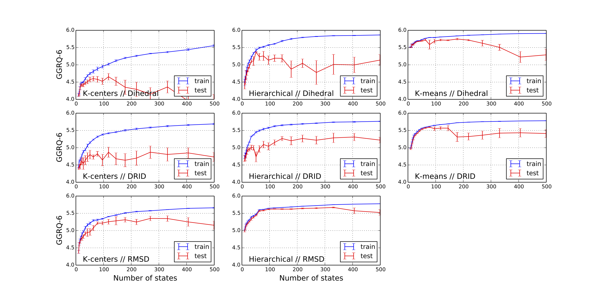

---
title: Fs Peptide folding
subtitle: Search Space, ($\tau=50\; \text{ps},\; n_{timescales}=3$)

$$
\newcommand\T{\Rule{0pt}{1em}{.3em}}
	\begin{array}{|c|c|}
	\hline \textbf{Category} & \textbf{Options} \\\hline
	  \text{Featurization} & \{\phi,\psi\}, \{\phi, \psi, \chi_1\}, \{\phi, \psi, \chi_1, \chi_2\} \\\hline
	  \text{Preprocessing} & \text{PCA, tICA, None} \\\hline
	  \text{# of tICs/PCs} \T & [2, 20] \\\hline
 	  \text{tICA } \gamma \T & \{0, 10^{-7}, 10^{-5}, 10^{-3}, 10^{-1}\} \\\hline
  	  \text{tICA weighting} & \{\text{True, False}\} \\\hline
	  \text{Clustering} & \text{$k$-centers, minibatch $k$-means} \\\hline
	  \text{# of states} & [10, 500] \\\hline
	\end{array}
$$

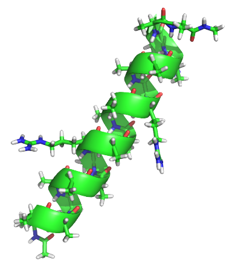

<footer class="source">
CV=5, 28 trajectories, each 500 ns. (aggregate 14$\mu s$)
</footer>

---
title: Fs Peptide folding

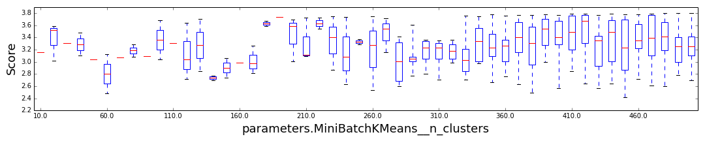

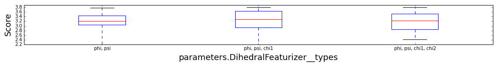

---
title: Fs Peptide folding
subtitle: Best model

$$
\newcommand\T{\Rule{0pt}{1em}{.3em}}
	\begin{array}{|c|c|}
	\hline \textbf{Category} & \textbf{Options*} \\\hline
	  \text{Featurization} & \{\phi, \psi, \chi_1, \chi_2\} \\\hline
	  \text{Preprocessing} & \text{tICA} \\\hline
	  \text{# of tICs} \T & 2 \\\hline
 	  \text{tICA } \gamma \T & 0 \\\hline
  	  \text{tICA weighting} & \text{True} \\\hline
	  \text{Clustering} & \text{m.b. $k$-means} \\\hline
	  \text{# of states} & 480 \\\hline
	\end{array}
$$

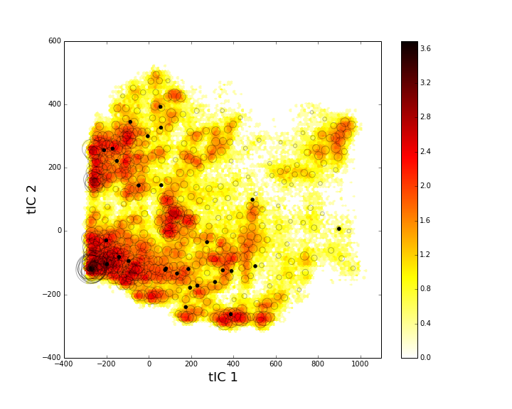

<footer class="source">
<a href="http://vspm9.stanford.edu/notebooks/fs-analysis">notebook</a>
</footer>

---
title: Doublewell MSMs

<pre class="prettyprint" data-lang="python">
from mixtape.cluster import NDGrid
from sklearn.pipeline import Pipeline
from mixtape.datasets import load_doublewell
from sklearn.grid_search import GridSearchCV
from mixtape.markovstatemodel import MarkovStateModel

ds = load_doublewell(random_state=1)
strided = [t[::100] for t in ds['trajectories']]
pipeline = Pipeline([
    ('grid', NDGrid( min=-np.pi, max=np.pi)),
    ('msm', MarkovStateModel(n_timescales=1, reversible_type='mle', ergodic_trim=True)),
])
grid = GridSearchCV(pipeline, param_grid=[
        {'grid__n_bins_per_feature': [s], 'msm__n_states': [s]} for s in n_states
    ], cv=5, return_train_scores=True, verbose=10)
grid.fit(strided)
print(grid.grid_scores_)
</pre>

---
title: Takeaways
build_lists: true

- Systematic evaluation and optimization of MSMs is possible
    - Incl. different clusterings, featurizations, protocols
- Overfitting is real. Systematic gap between training and testing performance.
- Optimal number MSM "states" is driven by the statistics, not just
  the physics.
- With tICA, $n_{states} < 1000$, MSM speed is not an issue
