% title: Fitting Master Equations
% subtitle: April 13, 2015
% author: Robert T. McGibbon
% author: arXiv:1407.8083
% thankyou: Thanks everyone!
% thankyou_details: Especially Muneeb, Matt, Christian, T.J., Vijay.
% contact: www<a href="http://msmbuilder.org">msmbuilder.org</a>
% contact: github<a href="http://github.com/msmbuilder/msmbuilder">msmbuilder</a>
% favicon: http://www.stanford.edu/favicon.ico

---
title: Overview

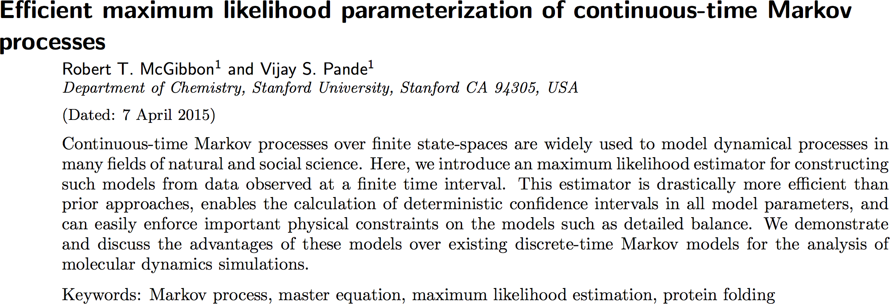

<footer class="source">R.T. McGibbon and V.S. Pande, “Efficient maximum likelihood parameterization of continuous-time Markov processes,” (2015), <a style="border-bottom: 0px;" href="http://arxiv.org/abs/1504.01804">arXiv:1407.8083</a>. </footer>

---
title: First Order Chemical Kinetics
subtitle: Matrix Formulation

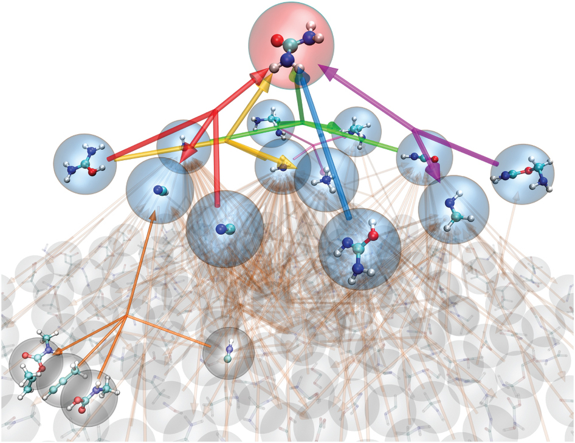

$$
\ce{U <=>[k_{12}][k_{21}] I <=>[k_{23}][k_{32}] F}
$$

$$
\frac{d\vec{p}}{dt} =  \underbracedbmatrix{p_U & p_I & p_F}{\vec{p}} \cdot
\underbracedbmatrix{
    -k_{12} & k_{12} & 0 \\
    k_{21} & -k_{21} - k_{23} & k_{23} \\
    0 & k_{32} & -k_{32}
}{\mathbf{K}}
$$

<footer class="source">
    L.-P. Wang et al. "Discovering chemistry with an ab initio nanoreactor" Nature Chemistry (2015) <a href="http://www.nature.com/nchem/journal/v6/n12/full/nchem.2099.html">doi:10.1038/nchem.2099</a>
</footer>

---
title: Master equations
<!-- subtitle: Related to transition probabilities -->

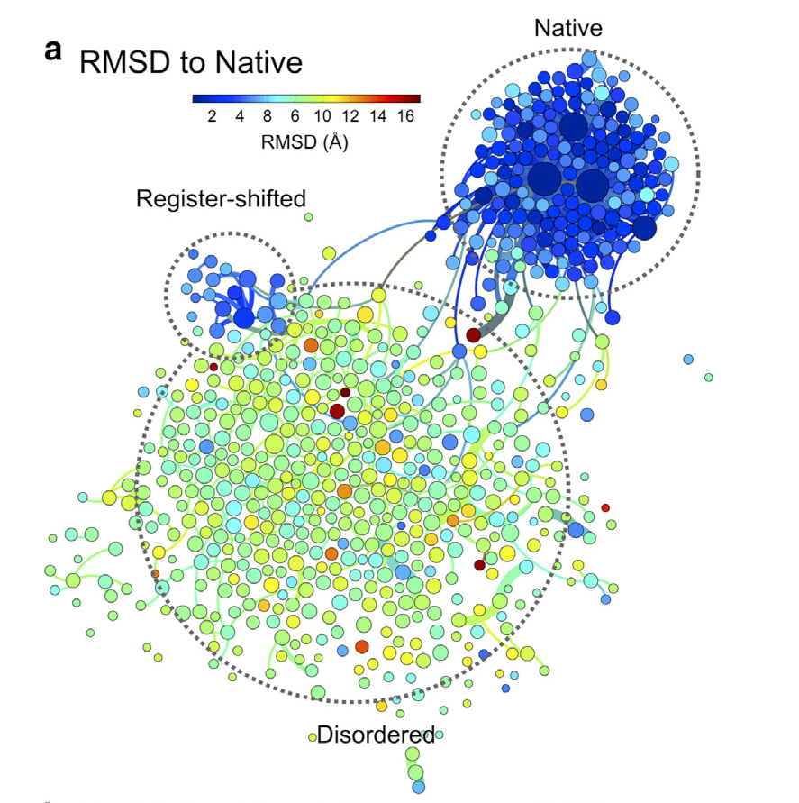

$$
\frac{dp_t}{dt} = p_t \, \mathbf{K}
$$

$$
p_{t+\tau} = p_t \, \underbrace{\exp(\tau\mathbf{K})}_{\mathbf{T}(\tau)}
$$

<!-- $$
\begin{align}
\frac{dp_t}{dt} &= p_t \, \mathbf{K} \\
p_{t+\tau} &= p_t \, \underbrace{e^{\tau\mathbf{K}}}_{\mathbf{T}(\tau)} \\
%% &= p_t \cdot \underbrace{\sum_{i=0}^\infty \frac{\tau^i \mathbf{K}^i}{i!}}_{\mathbf{T}(\tau)}
\end{align}$$ -->

<footer class="source">
C.R. Baiz et al. Biophys J. (2014) doi:10.1016/j.bpj.2014.02.008
</footer>

---
title: The embedding problem
subtitle: Markov <i>processes</i> vs. Markov <i>chains</i>

- Every continuous-time Markov process can be "sliced" at any $\tau>0$ to yield a discrete-time Markov chain.
- Not every discrete-time Markov chain has an embedded continuous-time Markov process.
- Necessary and sufficient conditions for embedability are unknown.

<footer class="source">
T.J. Lane et al. <a href="http://doi.org/10.1016/j.sbi.2012.11.002">Curr. Opin. Struct. Biol.</a> (2013) &nbsp;&nbsp;
E.B. Davies <a href="http://doi.org/10.1214/EJP.v15-733">Electon. J. Prob.</a> (2010)

</footer>

---
title: The embedding problem

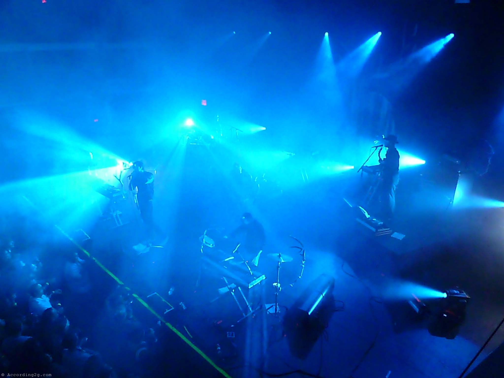

---
title: Fitting master equations
subtitle: From discrete-time data

$$
x = \{1, 1, 2, 1, 3, 3, 2, 1, 2, 3, 4, 4, 4, 3, \ldots\}
$$

$$ \Downarrow ?$$

$$
\mathbf{K} = \begin{bmatrix}
-2.4 & 2.4 &  & \\
2.2 &  -3.1 & 0.9 & \\
& 0.5 & -0.9 & 0.4 \\
& & 0.5 & -0.5
\end{bmatrix}
$$

---
title: Existing algorithims
subtitle: Estimating Markov processes from discrete-time data

- Route 1: first estimate discrete-time Markov chain, then ''solve'' embedding problem
    * $\{x_1, x_2, \ldots, x_n\} \rightarrow \mathbf{T}(\tau) \rightarrow \mathbf{K}$
    * Fast, but unsatisfactory.1,2
- Route 2: directly fit a Markov process
    * $\{x_1, x_2, \ldots, x_n\} \rightarrow \mathbf{K}$
    * Existing algorithims are slow $(O(n^5), O(n^6))$.3,4

<footer class="source" style="bottom: 40px">
1. E.B. Davies <a href="http://doi.org/10.1214/EJP.v15-733">Electon. J. Prob.</a> (2010) &nbsp;&nbsp;
2. D. Crommelin, E. Vanden-Eijnden <a href="http://doi.org/10.1016/j.jcp.2006.01.045">J. Comput. Phys.</a> (2006)  
3. J.D. Kalbfleisch, J.F. Lawless <a href="dx.doi.org/10.1080/01621459.1985.10478195">J. Am. Stat. Assoc.</a> (1985)</a>  &nbsp;&nbsp;
4. A. Hobolth, J.L. Jensen <a href="http://dx.doi.org/10.2202/1544-6115.1127">Stat. Appl. Genet. Mol. Biol.</a> (2005).
</footer>

---
title: New algorithm
subtitle: Fast (enough). Confidence intervals. Sparsity.
class: segue dark nobackground

---
title: Overview

<footer class="source">R.T. McGibbon and V.S. Pande, “Efficient maximum likelihood parameterization of continuous-time Markov processes,” (2015), <a style="border-bottom: 0px;" href="http://arxiv.org/abs/1504.01804">arXiv:1407.8083</a>. </footer>

---
title: Discrete-time data likelihood
subtitle: Fun with matrix exponentials

$$\begin{align}
P(x | \mathbf{K}, x_0) &= \prod_{k=0}^{N-1} \mathbf{T}(\tau)_{x_{k\tau},\, x_{(k+1)\tau}} = \prod_{i,j} \mathbf{T}_{ij}(\tau)^{\mathbf{C}_{ij}(\tau)}
\end{align}$$
 

$$\begin{align}
\underbrace{\mathcal{L}(\theta; \tau)}_{\color{data}\text{maximimze me!}} &\equiv \ln P(x | \mathbf{K}(\theta), x_0) \\
&= \sum_{i,j} \Big(\mathbf{C}(\tau) \circ \ln \exp\big(\tau\, \mathbf{K}(\theta)\big)\Big)_{ij}
\end{align}$$

---
title: Practical optimization 101
build_lists: true

 

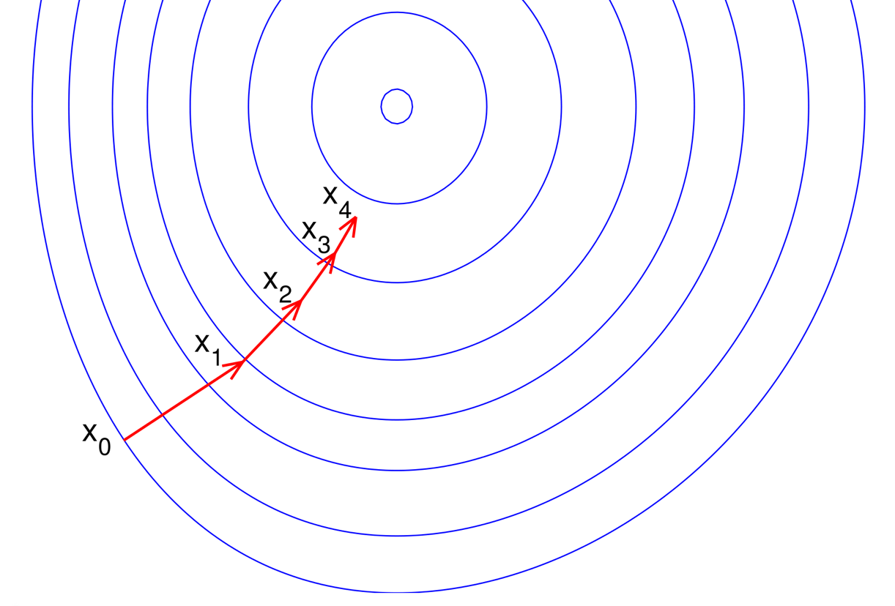

- Parameterize away the constraints, if possible.
- Calculate the gradient, quickly.
- Use a quasi-Newton method and a good guess.
- Cross your fingers.

---
title: Rate matrix constraints

$$
\mathscr{K} = \left\{\mathbf{K} = \{k_{ij}\} \in \mathbb{R}^{n \times n} : k_{ij} \geq 0 \text{ for all } i \neq j, k_{ii} = -\sum_{j\neq i} k_{ij} \right\}
$$

- Off diagonal elements are non-negative (n.b. $k_{ij}=0$ is okay).
- Each row sums to zero.
- Must have a stationary distribution, $\pi > 0$, s.t. $\pi \mathbf{K} = 0$.
- Reversibility / detailed balance:
    * $\pi_i k_{ij} = \pi_j k_{ji} \hspace{1em} \forall\; i \neq j$.

---
title: Parameterize away the constraints
subtitle: Example: a 2 x 2 rate matrix

$$
\mathbf{K}(\theta) \stackrel{?}{=} \begin{bmatrix}\theta_1 & \theta_2 \\ \theta_3 & \theta_4 \end{bmatrix}
; \theta \in \mathbb{R}^4
$$

 
$$
\mathbf{K}(\theta) \stackrel{?}{=}  \begin{bmatrix}-e^{\theta_1} & e^{\theta_1} \\ e^{\theta_2} & -e^{\theta_2} \end{bmatrix}
; \theta \in \mathbb{R}^2
$$

---
title: Parameterize away the constraints

 

- Detailed balance is essentially symmetry
    *  $\sqrt{\frac{\pi_i}{\pi_j}} k_{ij} = \sqrt{\frac{\pi_j}{\pi_i}} k_{ji} = s_{ij} = s_{ji}$
    * Only need to track "half" of the rate matrix
- Use log transform of the equilibrium distribution

---
title: Calculate the gradient quickly

 
$$\begin{align}
\mathcal{L}(\theta; \tau)
&= \sum_{i,j} \Big(\mathbf{C}(\tau) \circ \ln \exp\big(\tau\, \mathbf{K}(\theta)\big)\Big)_{ij} \\
\frac{\partial \mathcal{L}(\theta; \tau)}{\partial \theta_i} &= \text{something messy, but $O(n^3)$.}
\end{align}$$

Previous methods take $(O(n^5))$ or $(O(n^6))$ per iteration.

<footer class="source">R.T. McGibbon and V.S. Pande, “Efficient maximum likelihood parameterization of continuous-time Markov processes,” (2015), <a style="border-bottom: 0px;" href="http://arxiv.org/abs/1504.01804">arXiv:1407.8083</a>. </footer>

---
title: Computing error bars on the MLE

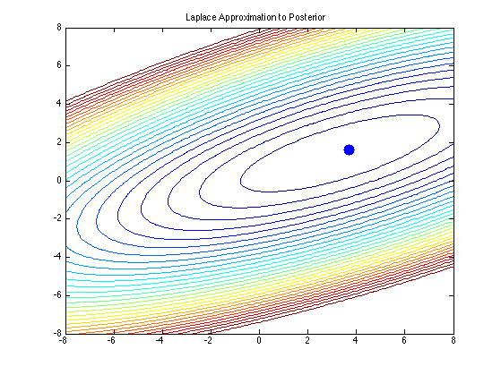

- Likelihood converges to a normal distribution.
- Asymptotic covariance $=$ inverse Hessian at the MLE.
- "Multivariate delta theorem"

 

$$
Var(h) \approx - \nabla_\theta h(\hat{\theta})^T \cdot H(\hat{\theta})^{-1} \cdot \nabla_\theta h(\hat{\theta})
$$

---
title: How well does it work?
class: segue dark nobackground

---
title: Example 1
subtitle: Sparsity

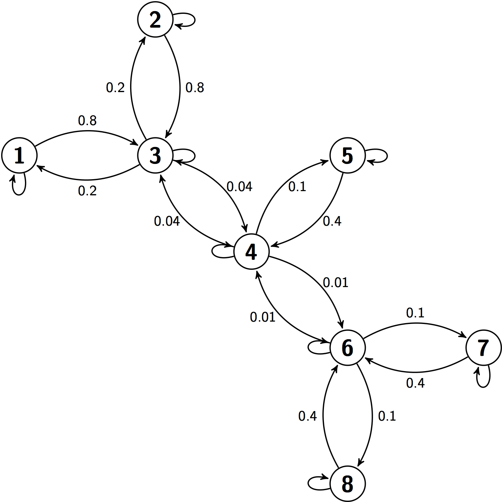

A simple eight state Markov process. Connected states are labeled with the pairwise rate constants, $\mathbf{K}_{ij}$.

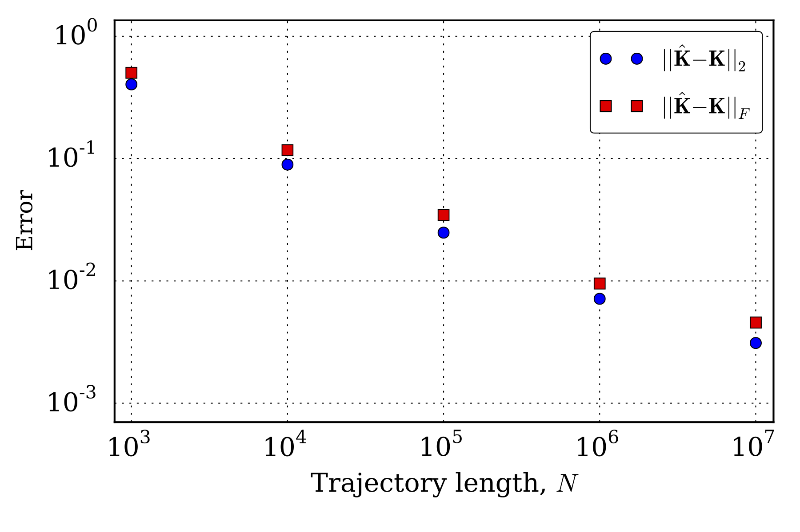

Convergence of the estimated rate matrix, $\mathbf{\hat{K}}$, to the true generating rate matrix for discrete-time trajectories of increasing length simulated from the process with a time step of 1.

---
title: Example 1
subtitle: Sparsity

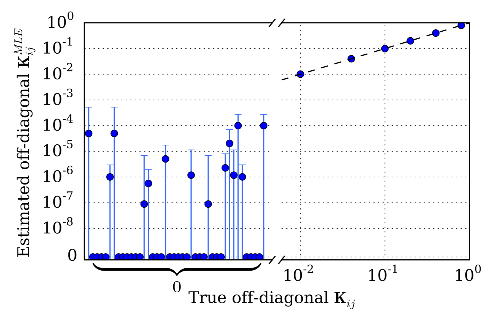

Comparison of the estimated and true off-diagonal rate matrix elements for a trajectory of length $N=10^{7}$ simulated from the process.

---
title: Example 2
subtitle: Error bars

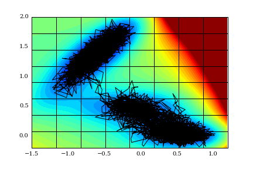
 
 

$$
z_{ij} = \frac{\hat{g}_i - \hat{g}_j}{\sqrt{\sigma^2_{\hat{g}_i} + \sigma^2_{\hat{g}_j}}} \overset{?}{\sim} \mathcal{N}(0, 1).
$$

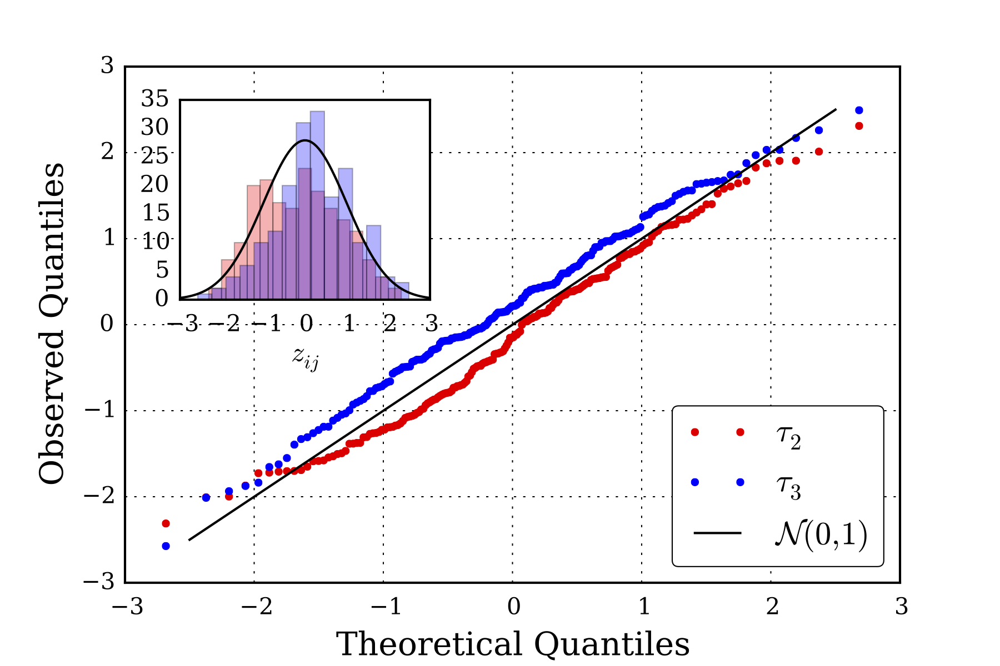

---
title: Example 3
subtitle: Accuracy

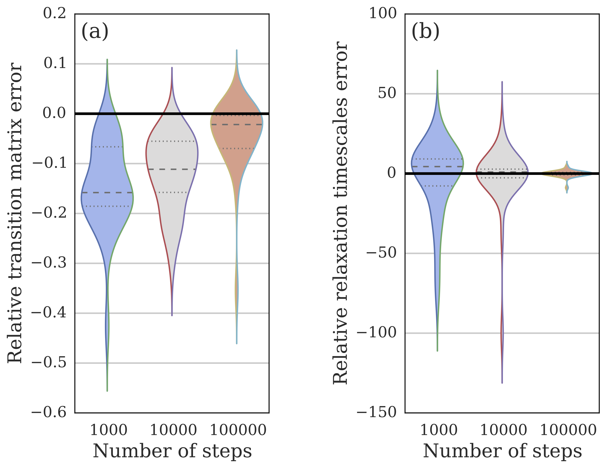

Relative error between continuous-time and discrete-time Markov models for
kinetics on random graphs. Values below zero indicate lower error for the
continuous-time model, whereas values above zero indicate the reverse.

---
title: Example 4
subtitle: Comparison with discrete-time models on WW Domain

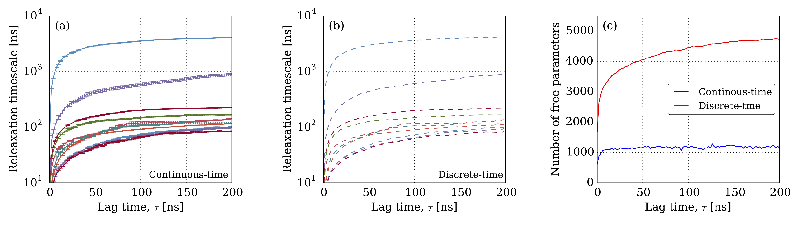

Relaxation timescales are essentially identical ($r^2 = 0.999978$), but the
continuous-time model has fewer nonzero parameters.

---
title: Example 4
subtitle: Comparison with discrete-time models on WW Domain

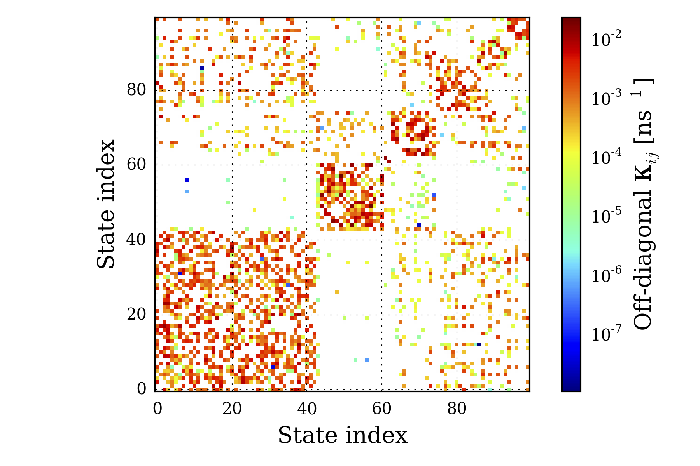

    The MLE rate matrix is sparse, which should make it easier to inteperpret.

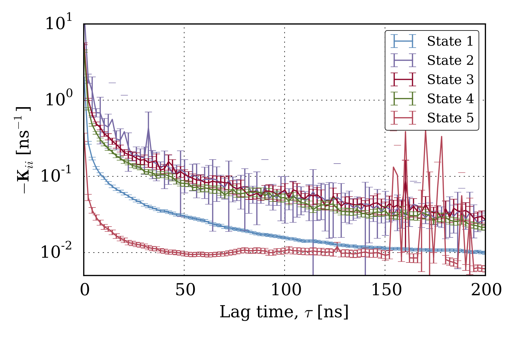

    We can monitor the convergence of individual elements of the rate matrix.

---
title: Conclusions

$$
\frac{dp_t}{dt} = p\mathbf{K}  \hspace{0.7in}vs.\hspace{0.7in} p_{t+\tau} = p_t \mathbf{T}(\tau)
$$

- Continuous-time models are more natural scientifically
    * But a little trickier to estimate statistically.
    * We've fixed that.
- The resulting models
    * A little sparser & easier to interpret.
- Implemented in MSMBuilder

