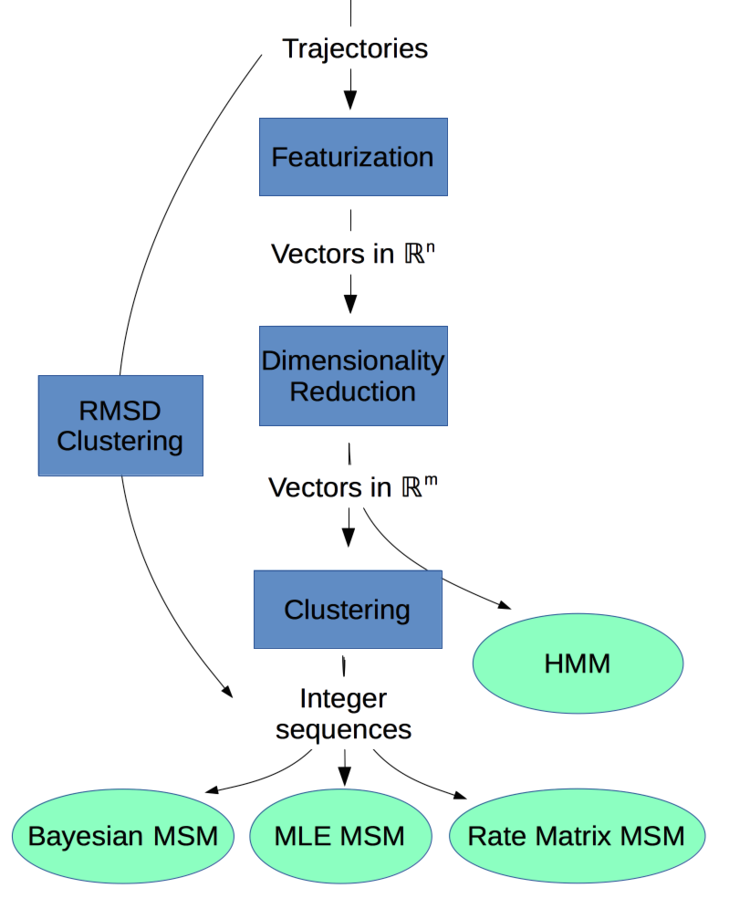

% title: What's new in MSMBuilder3?
% subtitle: Pande Group Meeting
% author: Robert T. McGibbon
% author: Dec. 8, 2014
% thankyou: Thanks everyone!
% thankyou_details: Team effort with  Kyle Beauchamp, Matt Harrigan, Christian Schwantes.   <pre class="prettyprint" data-lang='shell'>$ conda install -c https://conda.binstar.org/omnia msmbuilder</pre>
% contact: www <a href="http://msmbuilder.org/">web docs</a>
% contact: github <a href="http://github.com/msmbuilder/msmbuilder">msmbuilder</a>
% favicon: http://www.stanford.edu/favicon.ico

---
title: Goals

  - The [latest](http://pubs.acs.org/doi/abs/10.1021/ct300878a) [theory](http://arxiv.org/abs/1407.8083) + [algorithims](http://jmlr.org/proceedings/papers/v32/mcgibbon14.html)
  - Easier to use and more powerful
  - Complete [documentation](http://msmbuilder.org), with lots of [examples](http:/msmbuilder.org/latest/examples).
  - **Quick to add new features**

<pre class="prettyprint" data-lang='shell'>
$ conda install -c https://conda.binstar.org/omnia msmbuilder
$ msmb -h
</pre>

---
title: Enter Data Science

- Machine learning is mainstream now!
- Thousands of experts are using machine learning approaches
- Well-tested, performant, and facile implementations are available
- Writing your own is not the way to go!
    * E.g: is clustering _that_ special and MD-specific such that
    we need our own custom algorithms and implementations? No. 

---
title: Overview

Let's build on [scikit-learn](http://scikit-learn.org/stable/) idioms:

- Everyhing is a `Model`.
- Models are `fit()` on data.
- Models learn `attributes_`.
- Models `transform()` data.
- `Pipeline()` concatenate models.
- Meta-models like grid search.

---
title: Get some example data
subtitle: Distributed with a DOI on Figshare

<pre class="prettyprint" data-lang='shell'>
$ msmb AlanineDipeptide

downloading alanine dipeptide from http://downloads.figshare.com/article/
public/1026131 to /Users/rmcgibbo/msmbuilder_data
Example dataset saved: /Users/rmcgibbo/msmbuilder_data/alanine_dipeptide
</pre>

<pre class="prettyprint" data-lang='shell'>
$ ls ~/msmbuilder_data/alanine_dipeptide

ala2.pdb            trajectory_1.dcd    trajectory_3.dcd
trajectory_5.dcd    trajectory_7.dcd    trajectory_9.dcd
simulate_ala2.py    trajectory_1.log.gz trajectory_3.log.gz
trajectory_5.log.gz trajectory_7.log.gz trajectory_9.log.gz
trajectory_0.dcd    trajectory_2.dcd    trajectory_4.dcd
trajectory_6.dcd    trajectory_8.dcd    trajectory_0.log.gz
trajectory_2.log.gz trajectory_4.log.gz trajectory_6.log.gz
</pre>

---
title: Featurize trajectories

<pre class="prettyprint" data-lang='shell'>
$ msmb AtomIndices -d --heavy -p ~/msmbuilder_data/alanine_dipeptide/ala2.pdb \
  --out pairs.txt
$ msmb AtomPairsFeaturizer --trjs '~/msmbuilder_data/alanine_dipeptide/*.dcd' \
  --top ~/msmbuilder_data/alanine_dipeptide/ala2.pdb \
  --pair_indices pairs.txt --out distances/

AtomPairsFeaturizer(exponent=1.0,
          pair_indices=array([[ 1,  4],
       [ 1,  5],
       ...,
       [15, 18],
       [16, 18]]),
          periodic=False)
100%|#######################################################
##############################################|Time: 0:00:01
</pre>
---
title: Track the provenance

<pre class="prettyprint" data-lang='shell'>
$ cat distances/PROVENANCE.txt

MSMBuilder Dataset:
  MSMBuilder: 3.0.0-beta.dev-74b3ef7
  Command:  /Users/rmcgibbo/miniconda/envs/3.4/bin/msmb AtomPairsFeaturizer --trjs ~/msmbuilder_data/alanine_dipeptide/*.dcd --top /Users/rmcgibbo/msmbuilder_data/alanine_dipeptide/ala2.pdb --pair_indices pairs.txt --out distances
  Path:   distances/
  Username: rmcgibbo
  Hostname: Roberts-MacBook-Pro.local
  Date:   December 07, 2014 10:38 PM

== Derived from ==
MDTraj dataset:
  path:   ~/msmbuilder_data/alanine_dipeptide/*.dcd
  topology: /Users/rmcgibbo/msmbuilder_data/alanine_dipeptide/ala2.pdb
  stride: 1
  atom_indices  None
</pre>

---
title: Reduce the dimensionality (tICA)

<pre class="prettyprint" data-lang='shell'>
$ msmb tICA -h
$ msmb tICA -i distances/ -o tica.pkl -t tics --n_components 4
</pre>

<pre class="prettyprint" data-lang='python'>
$ ipython
In [1]: from msmbuilder.utils import load
In [2]: model = load('tica.pkl')
In [3]: model.&lt;TAB&gt;
model.components_          model.lag_time             model.partial_transform
model.covariance_          model.means_               model.score
model.eigenvalues_         model.n_components         model.set_params
model.eigenvectors_        model.n_features           model.summarize
model.fit                  model.n_observations_      model.timescales_
model.fit_transform        model.n_sequences_         model.transform
model.gamma                model.offset_correlation_  model.weighted_transform
model.get_params           model.partial_fit
model.offset_correlation_  model.summarize
</pre>

---
title: Load a transformed dataset
class: img-top-center

<pre class="prettyprint" data-lang="python">
>>> from msmbuilder.dataset import dataset
>>> import numpy as np
>>> import matplotlib.pyplot as pp
>>> X = np.concatenate(dataset('tics.h5'))
>>> pp.hexbin(X[:,0], X[:, 1], gridsize=250, bins='log')
</pre>

---
title: Fit an HMM, or Cluster + MSM
class: img-top-center

<pre class="prettyprint" data-lang="shell">
$ msmb GaussianFusionHMM -i tics.h5 --n_state 3 --n_features 4 \
    -o hmm.pkl
</pre>

<pre class="prettyprint" data-lang="shell">
$ msmb MiniBatchKMeans --n_clusters 100 --inp tics.h5 -t assignments.h5 
$ msmb ImpliedTimescales -i assignments.h5
</pre>

<pre class="prettyprint" data-lang="python">
>>> import pandas as pd; import matplotlib.pyplot as pp
>>> df = pd.read_csv('timescales.csv')
>>> pp.plot(df['Lag Time'], df['Timescale 1'])
</pre>

---
title: Higher-level automation with Pipelines

<pre class="prettyprint" data-lang="python">
>>> from sklearn.pipeline import Pipeline
>>> pipe = Pipeline([
      ('featurizer', DihedralFeaturizer(['phi', 'psi'])),
      ('tica', tICA(n_components=4, lag_time=10)),
      ('cluster', MiniBatchKMeans(n_clusters=100, batch_size=10000)),
      ('msm', MarkovStateModel(reversible_type='mle')),
])
>>> pipe.fit(dataset('~/my-data/*.dcd', topology='~/my-data/topology.pdb'))
>>> print(pipe.named_steps['msm'].summarize())
Markov state model
------------------
Lag time         : 1
Reversible type  : mle
Ergodic cutoff   : 1
Prior counts     : 0

Number of states : 100
[...]
</pre>
---
title: Model scoring & optimization

- Scoring based on spectral cross-validation (GMRQ)
- Bayesian hyperparameter optimization with osprey
    * [http://osprey.readthedocs.org/](http://osprey.readthedocs.org/)

<pre class="prettyprint" data-lang="yaml">
search_space:
  featurizer__types:
    choices:
      - ['phi', 'psi']
      - ['phi', 'psi', 'chi1']
    type: enum

  cluster__n_clusters:
    min: 10
    max: 100
    type: int
</pre>

